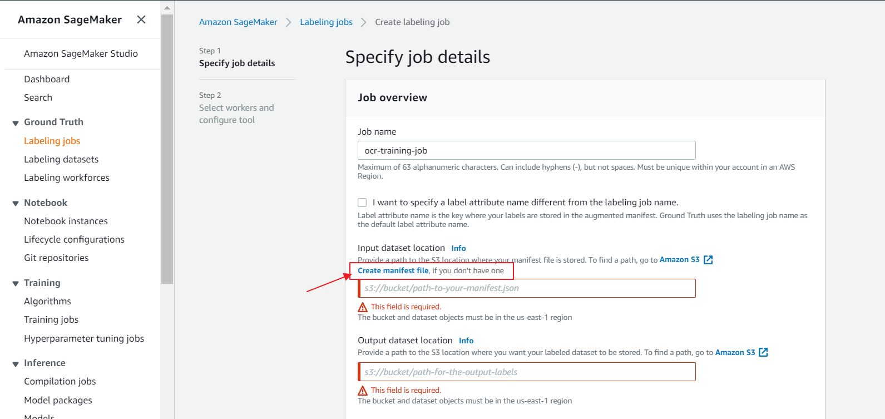
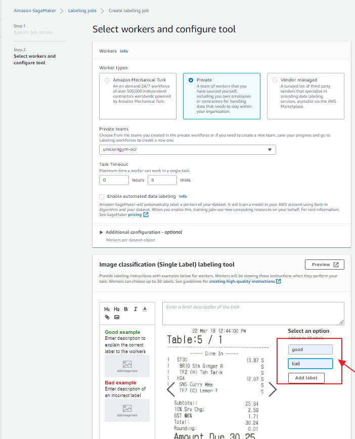
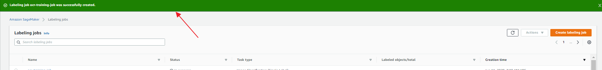
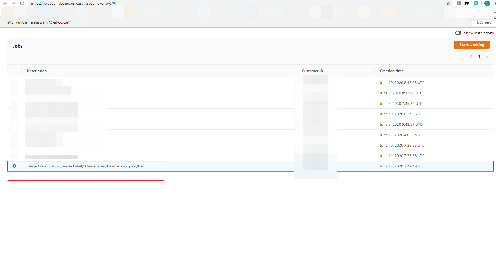
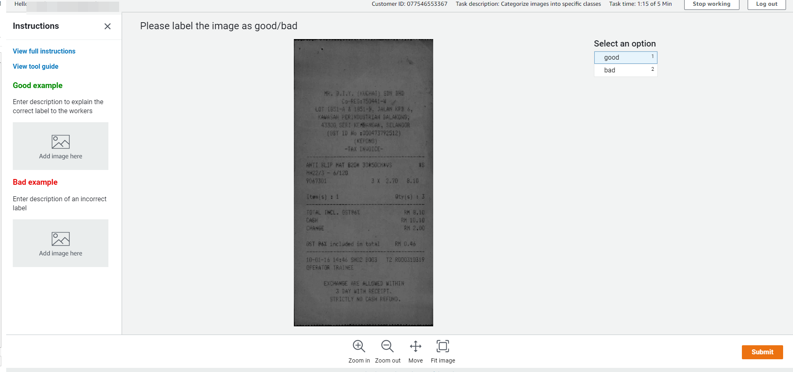
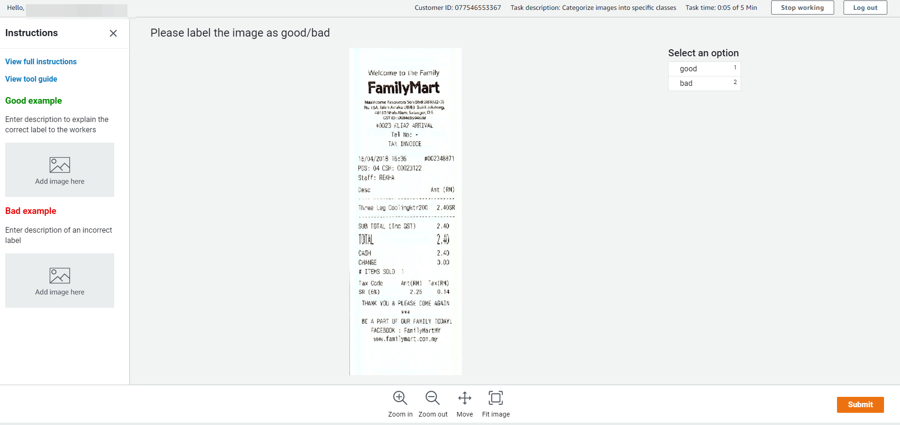

# Guideline for implement Amazon SageMaker Ground Truth

Steps for implementing Amazon SageMaker Ground Truth via AWS Management Console.

1. Create labeling job Amazon SageMaker Ground Truth.

2. Create manifest file on S3 bucket.

3. Select the manifest for this job.

4. Create the job and provide IAM role. Please ensure that IAM role of the job can access selected S3 bucket.

5. Choose "Image Classification (Single Label)" task.

6. Select "Private" workforce type.

7. Create the job and verify the job result.

8. Login to the workforce job console.

9. Choose the workforce job.

10. Do manual label of the image based on classifiction condition. An example show binary label types, Good and Bad labels.

11. Repeat the label job, until all of the image are labeled.

