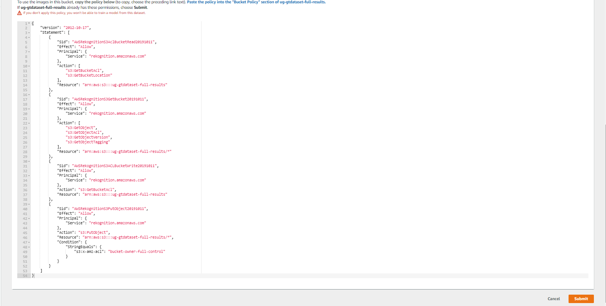
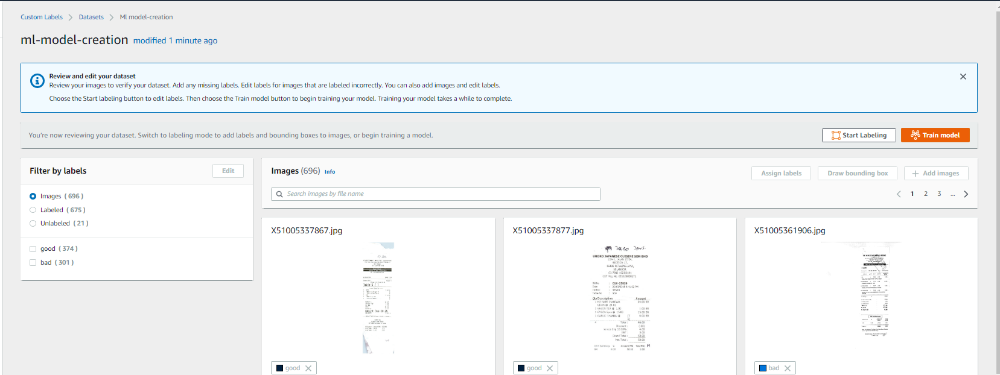

# Guideline for implement Amazon Rekognition Custom Labels

Steps for implement Amazon Rekognition Custom Labels with Ground Truth Data Set

1. Create dataset on Amazon Rekognition Custom Labels by selecting "Image images labeled by Amazon SageMaker Ground Truth". Also provide the manifest file of Grouth Truth location.

2. Configure S3 bucket policy to allow access from Amazon Rekognition Custom Labels.

3. Verify the dataset that you created.

4. Create Rekognition Custom Labels model by selecting Grouth Truth dataset.

