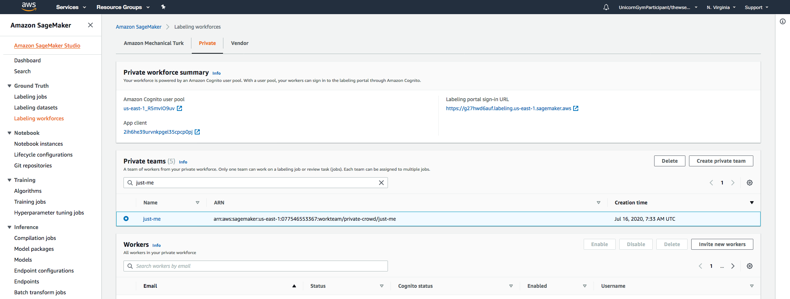
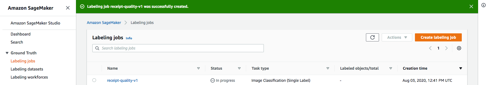
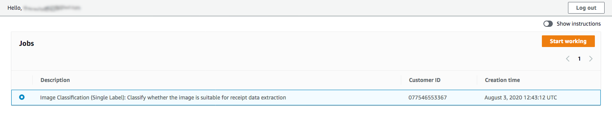
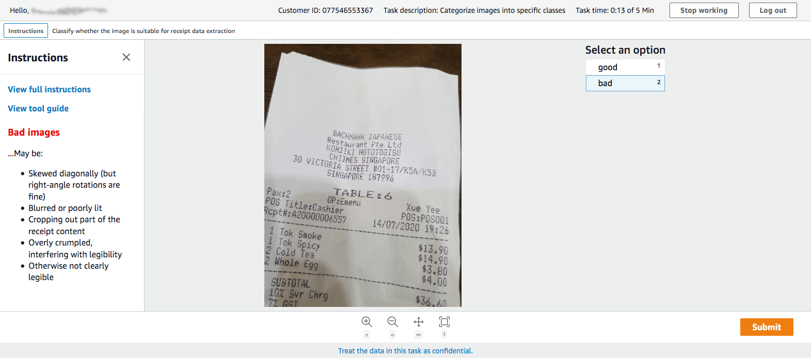

# Classifying Receipts with Amazon SageMaker Ground Truth

Data annotation for machine learning can be labor-intensive, but [Amazon SageMaker Ground Truth](https://aws.amazon.com/sagemaker/groundtruth/) can help by providing (amongst other things):

- **Pre-implemented but customizable UIs** for annotation tasks on unstructured data types (including e.g. text, images, video and even point clouds!)
- The ability to **distribute the work** to teams of annotators either privately (with SSO - no AWS Console access required); using vendor services (via AWS Marketplace); or the public crowd (via Amazon Mechanical Turk)
- **Active learning** algorithms that can accelerate certain task types by learning from humans to annotate some of the data for you

Follow the steps below to manually annotate the images in the `PreprocessTrainingBucket`, and you'll be able to use the [JSON-Lines](http://jsonlines.org/) formatted [output manifest file](https://docs.aws.amazon.com/sagemaker/latest/dg/sms-data-output.html) produced by SageMaker Ground Truth as the training data for your pre-processing model.

## 1. Define the Work Team

Private workteams are shared between [Amazon Augmented AI](https://aws.amazon.com/augmented-ai/) (for online human review) and Amazon SageMaker Ground Truth (for batch annotation), so you'll only need to on-board once between the pre-processing and human review loop setup.

In the [SageMaker Ground Truth Console](https://console.aws.amazon.com/sagemaker/groundtruth?#/labeling-workforces):

- Go to the *Ground Truth > Labelling Workforces* tab in the sidebar
- Select the *Private* tab
- Click **Invite new workers** to invite yourself (and/or your workers) to join the workforce by email
- You'll receive an email with a link to sign up, where you'll be asked to set a password: The private workforce portal uses SSO, so workers don't require access to your AWS Console.
- Once your workers are onboarded, click **Create private team**
- Choose a name for your team (maybe `just-me`, if it's individual for development?), and leave other settings as default
- Once the team is created, choose it from the list to enter the team detail page and then **add workers** to the team.

Note that team SNS notifications are supported for SageMaker Ground Truth annotation jobs, but not (at the time of writing!) for Amazon A2I review tasks.

You should now have a private team set up with you and/or your workers registered and able to log in to the labelling portal.

## 2. Create the Labelling Job

From the *Ground Truth > Labeling Jobs* [page of the Console](https://console.aws.amazon.com/sagemaker/groundtruth?#/labeling-jobs), click **Create labelling job**.

Give your labelling job a name (e.g. `receipt-quality-v1`) and select the option for **automated data setup**.

Labelling jobs' inputs are defined by an [input manifest file](https://docs.aws.amazon.com/sagemaker/latest/dg/sms-data-input.html) **cataloguing** the objects to be annotated. This automated setup option creates a manifest listing all objects in the S3 location we point it to... So for the **input dataset location** you should enter the URI where the receipt images (i.e. the `good/` and `bad/` folders) have been uploaded - inside the `PreprocessTrainingBucket`.

For the **output dataset location**, you can leave the default: the same location as the input dataset.

")

Further down the same page, we configure the **Data type** as *Image*, and set up the **IAM Role**:

You should see a `...-SageMakerNotebookRole-...` option in the drop-down, which has already been created for you by the CloudFormation stack with access to the `PreprocessTrainingBucket`. If not, you can select **Create a new role** but be sure to grant it access to the S3 bucket you need!

<!-- TODO: Why is the NotebookRole not showing up? -->

<!-- TODO: Are nested folders supported? -->

**Be sure to click the "Complete data setup" button and make sure it completes successfully, before continuing!**

")

Ensure the **Task type** is set to *Image > Classification* (as above) - leave the remaining (CORS, tags) settings as default and click **Next**.

In the next screen, we'll configure how the task gets routed to workers and set up the UI:

- Select 'Private' **worker type** and pick the **team** we created in Section 1.
- For our task, the default settings should be fine for:
  - **Timeout** 5 mins (because image classification is pretty quick)
  - **Automated labelling** off (because we don't have enough images for it to kick in anyway)
  - **Additional configuration > Number of workers per object** 1 (because a single annotation per image should be sufficient for our example)

In fact (like many) this annotation task is not so straightforward as you might think in the general case, and so you might like to add some specifics about what is acceptable and unacceptable in the **short description** and **details** and **additional instructions** panels on this page! Unearthing and resolving (via consensus) disagreement between annotators is exactly what the "Number of workers per object" can help with.

The most important part of the UI setup is **defining the labels** which should be **exactly**:

- `good`
- `bad`

...because the model's outputs are interpreted by the `FunctionPreProcess` Lambda, so any discrepancies like different casing or names would need to be reflected in updates to the implementation in the [fn-preprocess/](../fn-preprocess) folder.

")

Once the routing and task UI setup is complete, you're ready to click **Create** to start your labelling job.

## 3. Label the Images

If you created your labelling job successfully, it should now show as 'in progress'.

You (and/or the **workers** you added to your **private team**) should log in to the **Labelling portal**: Find the URL via the *Private* tab of the [Labelling workforces Console page](https://console.aws.amazon.com/sagemaker/groundtruth?#/labeling-workforces), or from the email you received when setting up.

From there, you should see a new **Job** appear in your queue - although it may take a few seconds to a couple of minutes to come through. You can refresh the page to force check for updates.

Click **Start working** to start working through the sample images and for each one select the appropriate class from the right hand sidebar, then click **Submit**. Remember there's a timeout per image, so you can always **Stop working** to indicate you're taking a break!

Once all the images are annotated, the job status should update (again may take a little time) to `Complete` in the [console](https://console.aws.amazon.com/sagemaker/groundtruth?#/labeling-jobs).

## 4. Using the Results

Clicking on the completed job from the list screen, you'll be able to see the details of the job including a hyperlink to the **output dataset location** in S3.

Within this folder, you'll be able to find the **output manifest file** (to use with Rekognition, or SageMaker-based models for that matter) at `manifests/output/output.manifest`.

For each image in your dataset this output manifest file lists the `source-ref` S3 URI of the image, and the labels plus metadata tagged by the labelling job.
