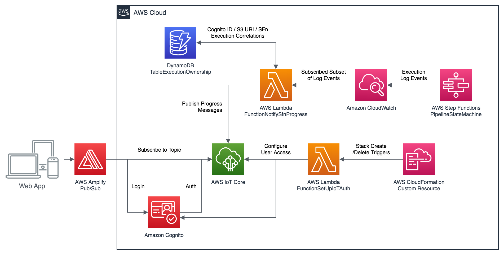

# Notifications with AWS IoT Core and Amplify PubSub

This folder contains assets specific to the IoT-based progress notifications component.

## Component Architecture Overview

When a Step Function execution is triggered (by the user's upload of an image into the upload bucket), the state machine begins to emit log events to CloudWatch.

A Lambda function is subscribed to pick up these events, and publish them to the originating user's IoT Core topic - from where they're visible to the web UI via Amplify's PubSub library.

### Key Challenges

1. Because our state machine is triggered implicitly by S3 uploads (rather than through a custom app-facing API combining the upload and execution start operations):
    - The client doesn't automatically know what SFn execution ID(s) it's started
    - The initial input to the Step Function is the only place where this information is reliably present (SFn error events might omit data fields, but will always contain the SFn execution ID)
    - **...so tracking the correlation between S3 upload URI, Cognito ID, and SFn Execution ID is not trivial**
2. Granting Cognito identities access to IoT topics requires *both*:
    - Attaching an appropriate IAM policy to the Authenticated Role of the Cognito Identity Pool, *and*
    - Attaching *each identity* (user) as principal to an IoT Core policy
    - **...so setting up Cognito user permissions is not trivial** - especially Cognito draws a separation between [users and identities](https://aws.amazon.com/premiumsupport/knowledge-center/cognito-user-pools-identity-pools/), and both pools are set up by Amplify rather than our custom stack.

## Troubleshooting PubSub Permissions

If you're seeing permissions errors when the web UI tries to connect to PubSub topics, then `FunctionSetUpIoTAuth` has let you down: Your Cognito user's permissions were not correctly set up during on-boarding.

### Check your Cognito Identity pool AuthRole IAM permissions

**TL;DR:** Check your `amplify-....-authRole` [IAM Role](https://console.aws.amazon.com/iam/home#/roles) has the `AWSIoTConfigAccess` and `AWSIoTDataAccess` managed policies attached.

**Walkthrough:**

- Open the [AWS IAM Console Roles tab](https://console.aws.amazon.com/iam/home#/roles) and search for a role named something like `amplify-{APPNAME}-{BRANCHNAME}-{RANDOM}-authRole`.
- If needed (e.g. lots of similar looking roles), you can trace your app's authenticated role through from the Amplify Console:
  - Open your app in the [Amplify Console](https://console.aws.amazon.com/amplify/home) and go to the "Backend environments" tab.
  - You will probably see just one environment, and should click through to the **Authentication** area.
  - From here, you'll see a direct link to view your **federated identities pool** in [Amazon Cognito](https://console.aws.amazon.com/cognito/pool/) (or, if you struggled, just go to the Amazon Cognito console and pick the **Identity Pool** that looks right).
  - From the dashboard for your Identity Pool, click the **Edit identity pool** link in the top.
  - The Edit page will include a drop-down listing your **Authenticated role** name (but no clickable-link - you'll still have to go find it in [IAM Console](https://console.aws.amazon.com/iam/home#/roles)! 😖)
- From the correct role's Summary page in IAM, you'll see a blue **Attach policies** button on the (default) 'Permissions' tab.
- Click the button, and attach both `AWSIoTConfigAccess` and `AWSIoTDataAccess` to the role.

### Check your specific Cognito Identity has IoT permissions

**TL;DR:** Your Cognito Identity ID must have been attached to the solution's [IoT Policy](https://console.aws.amazon.com/iot/home?#/policyhub).

**Your Cognito Identity ID is not your login username!** Identity IDs usually consist of the AWS Region and a GUID, e.g: `us-east-1:12345678-abcd-1234-abcd-123456589abc`.

**Walkthrough:**

- If you're just testing out with one or two users, you can review the list of identity IDs from the [Cognito Identity Pools Console](https://console.aws.amazon.com/cognito/federated/): Select the solution's pool from the list, then go to the **Identity browser** tab on the left hand side.
  - Otherwise, we log it for you in the web app: Just sign in and open your browser's dev tools (press `F12`), and scroll through the console output until you find your Identity ID.
- Next you'll need your **IoT policy name** from the [IoT Core Console](https://console.aws.amazon.com/iot/home?region=us-east-1#/policyhub):
  - Open the IoT Core Console
  - Navigate to Secure > Policies on the sidebar
  - Find the policy tile with a name like `amplify-{APPNAME}-{some other stuff}-AmplifyIoTAccessPolicy-{RANDOM}`
  - ^ It's this name you need, not the ARN
- Unfortunately there's no UI for this action, so you'll need to either:
  - Use the [AWS CLI](https://aws.amazon.com/cli/) to run `aws iot attach-policy --target {IdentityId} --policy-name {PolicyName}`
  - ...Or if you prefer working in a Python environment, check out the [fn-setup-iot-auth code](fn-setup-iot-auth) for the equivalent [Boto3 command](https://boto3.amazonaws.com/v1/documentation/api/latest/reference/services/iot.html#IoT.Client.attach_policy)

## Automating IoT Policy Attachment (Old Instructions)

Create a new [Lambda function](https://console.aws.amazon.com/lambda) with Function code from [smartocr-post-authentication.py](smartocr-post-authentication.py)

* Function name: <b>smartocr-post-authentication</b>
* Runtime: Python 3.8
* Execution role: Create a new role with basic Lambda permissions

After function is created, go to <b>Permissions</b> tab to open the role (e.g. smartocr-post-authentication-role-e73v7toi), and attach the following policies:
* AWSIoTConfigAccess
* AmazonCognitoPowerUser

In IAM, search for <b>amplify-smartocr</b> and select the role that ends with <b>authRole</b>. This role was created by Amplify and assumed by authenticated users. Attach the following policies:
* AWSIoTConfigAccess
* AWSIotDataAccess

Go to [Cognito User Pool](https://console.aws.amazon.com/cognito/users) and choose <b>Triggers</b> from the left navigation pane. In the <b>Post authentication panel</b>, select the Lambda function created previously: `smartocr-post-authentication`
